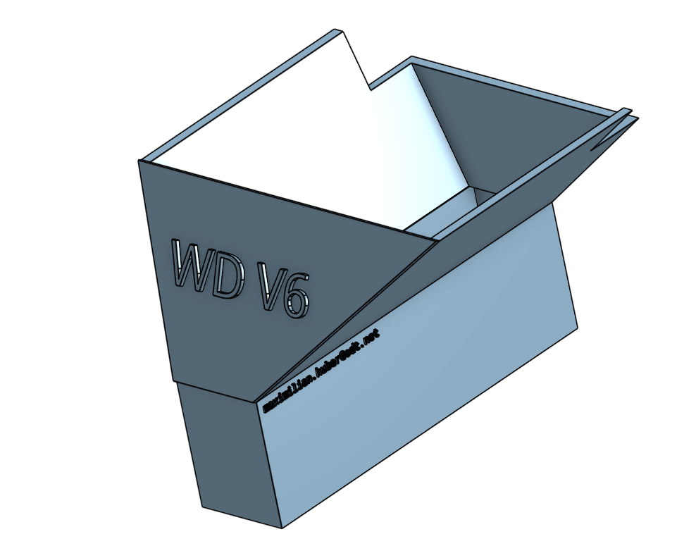

# A40 Shroud

## Usescase
Funnel air into a Nvidia A40 GPU for better performance.
Is stuck into the open side of the GPU, to ensure good performance.

## Design
The funnel is designed by [Maximilian Huber](https://github.com/Maxiboy441) (maximilian.huber@odt.net) in [onshape](https://cad.onshape.com/documents/9f062b369cdccb79ac31010a/w/741c08fe16b449871f3a264e/e/628e238f0866c54fb77d6d1e?renderMode=0&uiState=65c373f1c14eba61f044ee36).
Feel free to make adjustments or/and contact me (open an issue).

## Model

